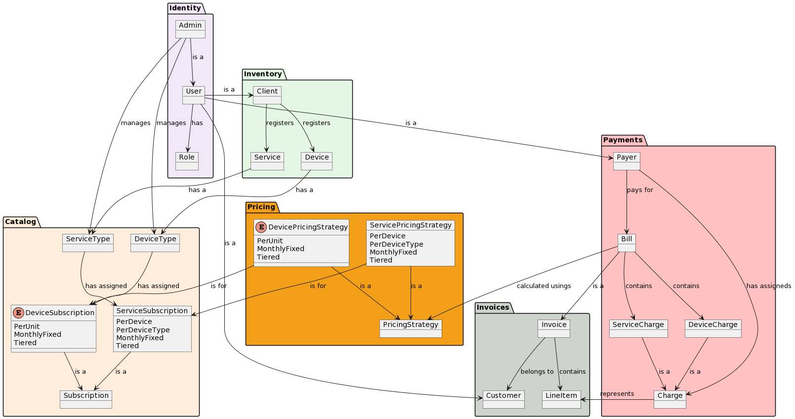

# NinjaOne RMM

RMM Assessment for Backend Position at NinjaOne. 

## Brief Description

NinjaoneRMM is a basic RMM system that allows managing different devices and services contracted by clients, as well as charging for these depending on the associated subscription.

### Basic functionalities:

- Manage the types of devices and services.
- Take control of customer inventory.
- Collect and generate invoices for contracts.

## How to Run

In order to run the application correctly it is necessary to have a *mysql* database. This must be configured in `application.yml` file, in the `spring.datasource` section. For ease, you can set the following environment variables:

- MYSQL_HOST (default `localhost`)
- MYSQL_DATABASE (default `ninjaone`)
- MYSQL_USER (default `root`)
- MYSQL_PASS (default `password`)

To compile the application, the following command must be executed:

    ./gradlew build -x test

To run the unit and acceptance tests:

    ./gradlew test

To run the application:

    ./gradlew bootRun

## Docker Support

In order to make it easier to run the project, a `Dockerfile` containing the application has been created. This is used via `docker-compose` to run it alongside a *mysql* database and *phpMyAdmin* in case you want to query the database. These files are located in the **deploy** folder.

To launch the containers it is only necessary to execute the `deploy.sh` script:

     ./deploy.sh

If you do not have execute permissions, can be assigned with the following command:

     chmod u+x deploy.sh

## Usage

In the docs **folder** there is a collection of *Postman* with the different endpoints of the application to be able to interact with it.

Likewise, you can access the *swagger* endpoints, `/swagger-ui/index.html` and `/v3/api-docs`, where you have information about the endpoint's requests and responses.

### As Admin:
    
(By default there is an administrator which is configured through the `application.yml` file in the root section)

- You can view, edit and delete system users.
- You can create, list, edit and delete types of devices and services.
- You can choose the type of subscription to charge for different devices and services.

### As User:

(Anyone can register as a user in the application)

You can create, list, edit, and delete the devices and services associated with your account.
You can make the "payment" for the contracted services at the end of the month.
You can download the monthly invoices of the "payments" made.

### Basic Example.

Administrator:
- Create the following types of devices:
  - Windows ($4 for each device).
  - Mac ($4 for each device).
- Create the following types of devices:
  - Antivirus ($5 for each Windows, $7 for each Mac).
  - Backup ($3 for each device).
  - PSA ($2 for each device).
  - Screen Share ($1 for each device).

User:
- It is registered in the system.
- Create the following devices: 2 Windows, 3 Macs.
- Create the following services: Antivirus, Backup, Screen Share.
- Pay for services.
- Download the invoice (total charge $71).

## Modules

- `Identity`: Manages system users.
- `Catalog`: Manages the different types of devices and services along with their subscriptions.
- `Inventory`: Keeps record of contracted devices and services by the clients.
- `Payments`: Provides functionalities to charge customers based on their charged services.
- `Pricing`: Provides information about the price of devices and services based on their subscription types.
- `Invoices`: Keeps record of monthly generated invoices.

### Diagram
